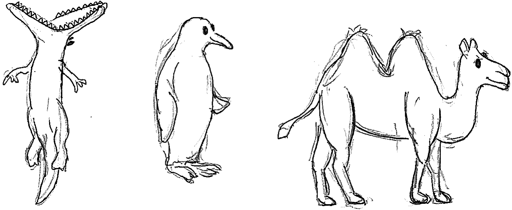

<!-- PROJECT LOGO -->
<br />
<p align="center">

  <h3 align="center">The Tolman-Eichenbaum Machine</h3>
  
  <p align="center">
    
  </p>

  <p align="center">
    ·
    <a href="https://github.com/djcrw/generalising-structural-knowledge/issues">Report Bug</a>
    ·
    <a href="https://github.com/djcrw/generalising-structural-knowledge/issues">Request Feature</a>
    ·
  </p>

<!-- TABLE OF CONTENTS -->
## Table of Contents

* [About the Project](#about-the-project)
* [Getting Started](#getting-started)
  * [Installation](#installation)
  * [Running models](#Running-models)
  * [Pytorch version](#Pytorch-version)
* [Contact](#contact)
* [Acknowledgements](#acknowledgements)


<!-- ABOUT THE PROJECT -->
## About The Project

This project contains a tensorflow 1.9.0 and a tensorflow 2.3.0 implementation of the Tolman-Eichenbaum Machine ([paper](https://www.sciencedirect.com/science/article/pii/S009286742031388X)).

In the tensorflow 2 (tem_tf2) version, it has all the relevant code for the simulations in the recent Nature Neuroscience review ([paper](https://www.nature.com/articles/s41593-022-01153-y)).


<!-- GETTING STARTED -->
## Getting Started

You need to install [python 3](https://www.python.org/download/releases/3.0/) and [tensorflow 1.9.0](https://www.tensorflow.org/) or [tensorflow 2.3.0](https://www.tensorflow.org/)

<!-- INSTALLATION -->
### Installation

Clone the repo
```sh
git clone https://github.com/djcrw/generalising-structural-knowledge.git
```

<!-- RUNNING MODELS -->
### Running models

```sh
python3 run_tem.py
```

Will take ~1hrs before training starts 

Use notebook to load and visualise cell representations and to do behavioural analyses

<!-- PYTORCH VERSION -->
### Pytorch version

Jacob Bakermans has made a pytorch implementation of TEM found here https://github.com/jbakermans/torch_tem


<!-- CONTACT -->
## Contact

James Whittington - [@jcrwhittington](https://twitter.com/jcrwhittington) - jcrwhittington at gmail.com

Project Link: [https://github.com/djcrw/generalising-structural-knowledge](https://github.com/djcrw/generalising-structural-knowledge)


<!-- ACKNOWLEDGEMENTS -->
## Acknowledgements

Thanks to Jacob Bakermans for the cover image!
